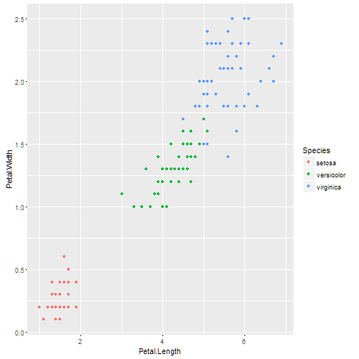

IRIS speicies prediction
========================================================
author: K. M. Mohsin
date: 9/18/2016
autosize: true

Introduction
========================================================

- This shiny app is to predict "iris" flower "species" based on "random forest" algorithm. 
- Once, attributes of flower are given this app will predict the species. 
- This app also plots k means cluster of "iris" R- dataset.

## Input of Shiny Applications
Once input are typed in text box on left panel user should hit "predict" button to see predicted "species". Four attributes are
- 1.	Sepal Length
- 2.	Sepal Width
- 3.	Petal Length
- 4.	Petal Width

Beside these four numeric input users will be able to choose axis of cluster plot from drop down menu. 

Prediction Algorithm
========================================================

"Random forest" machine learning algorithm used to predict speices. 

### Prediction with Random Forest

```r
library(randomForest)
data("iris")
mod_rf <- randomForest(Species~.,data=iris,ntrees = 8)
test<-iris[1,1:4]
pred_test<-predict(mod_rf,newdata = test) #results of test
as.character(pred_test)
```

```
[1] "setosa"
```

Plot
========================================================
In second portion of shiny app I have shown interactive K-means clustering. 



Thanks
=============================================================

### References

1. Shiny app:[https://kmmohsin.shinyapps.io/iris_pred_app_deploy/][1]
2. Git Repo: [https://github.com/MohsinKM/DataProdDev.git] [2]
[1]: https://kmmohsin.shinyapps.io/iris_pred_app_deploy/
 "Title"
[2]: https://github.com/MohsinKM/DataProdDev.git 
